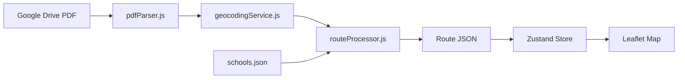

# AGENTS.md - AI Agent Quick Reference

> **Purpose**: Lightning-fast context for AI coding assistants. Read this first.

## TL;DR

**Bus route mapping app for Portland Public Schools (PPS)**

```
PDFs (Google Drive) → Parse stops → Geocode addresses → Display on Leaflet map
```

---

## Tech Stack

| Layer | Technology |
|-------|------------|
| Frontend | React 18 + TypeScript + Vite |
| SEO | react-helmet-async |
| State | Zustand |
| Maps | Leaflet + react-leaflet |
| Backend | Node.js + Express (ES Modules) |
| Geocoding | Google Maps Geocoding API |
| Routing | Google Maps Directions API & Routes API |
| Icons | **Font Awesome ONLY** (no react-icons) |
| Testing | Vitest (Frontend), Node --test (Backend) |

---

## Critical Rules

1. **🚫 NO paid API calls on page load** - Only call external APIs on explicit user action. **✅ EXCEPTION: Address autocomplete is allowed** - Google Places API calls for address autocomplete are explicitly allowed when triggered by user typing (HomePage, Explorer, Admin pages)
2. **🚫 NO react-icons** - Use Font Awesome exclusively (`<i className="fas fa-icon">`)
3. **📍 Coordinate order**: Internal = `[lng, lat]`, Leaflet = `[lat, lng]`
4. **📝 Update TechPage.tsx** when changing functionality

---

## Key Files

```
frontend/
  src/
    types/index.ts          # TypeScript interfaces (Stop, Route, School)
    store/useStore.ts       # Zustand global state
    pages/
      HomePage.tsx          # Landing page - address + school input
      TechPage.tsx          # Technical documentation (UPDATE THIS!)
    components/
      MapView.tsx           # Main Leaflet map component

backend/
  server.js                 # Express server, all API routes
  services/
    driveService.js         # Google Drive PDF fetching
    pdfParser.js            # Extract stops from PDFs
    geocodingService.js     # Google Maps geocoding
    directionsService.js    # Google Maps routing
    routesService.js        # Google Maps Routes API (Matrix)
    routeProcessor.js       # Full PDF→JSON pipeline
    neighborhoodService.js  # Reverse geocoding for neighborhoods
    schoolBoundaryService.js # Assigned schools lookup (GeoJSON)

data/
  schools.json              # All schools with coordinates
  schools/{id}/
    pdfs/                   # Raw PDF files
    processed-routes/       # Parsed JSON routes
```

---

## Data Flow



---

## Core Types

```typescript
interface Stop {
  id: string;
  address: string;
  coordinates?: [number, number];  // [lng, lat]
  isSchoolStop?: boolean;
  neighborhood?: string;
}

interface Route {
  id: string;
  name: string;                    // Route number, e.g., "100"
  direction?: 'Morning' | 'Afternoon';
  stops: Stop[];
  geometry?: [number, number][];   // [lat, lng][] for Leaflet polyline
}

interface School {
  id: string;
  name: string;
  coordinates?: [number, number];  // [lng, lat]
  driveLink: string | null;        // Google Drive folder URL
}
```

---

## API Endpoints

| Endpoint | Method | Purpose |
|----------|--------|---------|
| `/api/schools` | GET | List all schools |
| `/api/schools/assigned` | GET | Get assigned schools by location |
| `/api/schools/:id` | GET/PUT | Get/update school |
| `/api/routes/calculate` | POST | Calculate route geometry |
| `/api/geocode/address` | POST | Geocode single address |
| `/api/neighborhoods` | GET | Get neighborhoods from routes |
| `/api/pdf-sync/:schoolId` | POST | Sync PDFs from Drive |

---

## Common Tasks

### Add a new page
1. Create in `frontend/src/pages/`
2. Add route in `frontend/src/App.tsx`
3. Update `docs/meta/PAGES_INDEX.md`

### Add a new API endpoint
1. Create route in `backend/routes/`
2. Register in `backend/server.js`
3. Business logic goes in `backend/services/`

### Work with maps
- Use `DarkModeTileLayer` component
- Convert coords: `[lng, lat]` → `[lat, lng]` for Leaflet
- Icons: `utils/fontAwesomeIcons.ts`

### Deployment
- **Script**: `./deploy.sh`
- **What it does**: Pulls latest from `main` and rebuilds frontend (process restarts are handled by your platform/orchestrator)
- **When to use**: After merging changes to `main` or when the user says "deploy"
- **Logs**: `logs/server.log` (runtime) and `logs/build.log` (build process)

### Testing
- **Run all tests**: `npm test` (includes backend, frontend, and type checking)
- **Backend tests**: `npm run test:backend` or `node --test backend/tests/*.test.js`
- **Frontend tests**: `npm run test:frontend` or `cd frontend && npm run test`
- **Type checking**: `npm run test:types` (runs `tsc --noEmit` in frontend)
- **Location**: Backend tests in `backend/tests/`, Frontend tests in `frontend/src/**/*.test.ts`

---

## Quick Links

- **Full architecture**: [ARCHITECTURE.md](./ARCHITECTURE.md)
- **Page index**: [PAGES_INDEX.md](./docs/meta/PAGES_INDEX.md)
- **Conventions**: [.cursorrules](./.cursorrules)
- **Types**: [frontend/src/types/index.ts](./frontend/src/types/index.ts)

---

## URL & UI State Management

The application maintains a strict bidirectional sync between the global Zustand store (`useStore.ts`) and the browser URL (`useUrlState.ts`). This is critical for deep-linking and back-button support.

### Key Logic & Constraints
1. **School Transitions**: Changing a school (`setSelectedSchool`) MUST clear existing routes, stops, and any `/my-stop` URL state immediately. This prevents old school data (or stops from the previous school) from being synced to the new school's URL during the transition.
2. **Initial Sync**: On mount, the URL is the source of truth. `useUrlState` blocks syncing state back to the URL (`hasSyncedFromUrlRef`) until all URL-specified routes and stops are loaded and selected.
3. **Route & Stop Relationship**: Any change to route selection (toggling a route) MUST clear the `selectedStop`. This ensures the UI doesn't show a stop for a hidden route.
4. **Direction Filtering**: When switching between Morning/Afternoon/Both, the app tries to persist selection by matching route names across directions.
5. **Map Intent**: Map movements (zooming/fitting) are driven by a `mapIntent` object in the store, which is also reflected in the URL's `focus` parameter.

### Critical Files
- `frontend/src/store/useStore.ts`: Global state and atomic actions.
- `frontend/src/hooks/useUrlState.ts`: Orchestrates the sync between store and URL.
- `frontend/src/services/urlState.ts`: Pure functions for parsing/building URL paths.

---

*Last updated: January 5, 2026*

