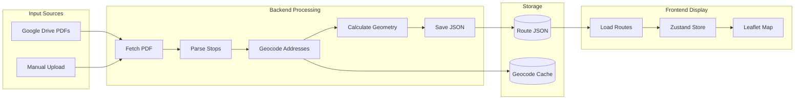
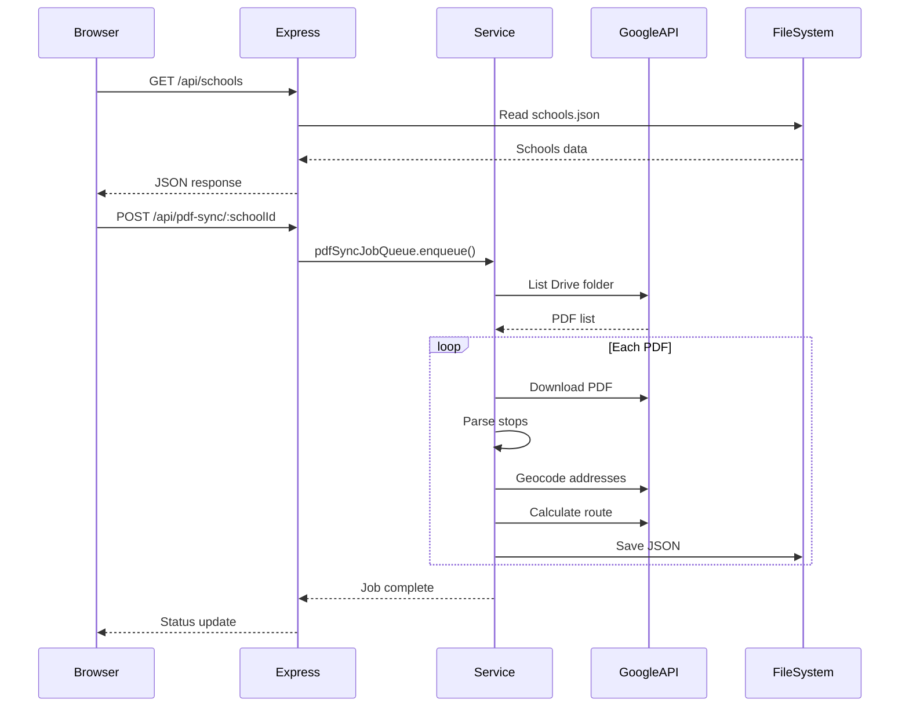
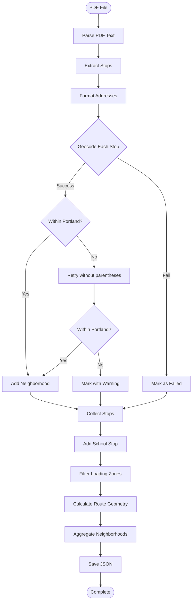

# PPS Bus Maps - Architecture Documentation

> **Comprehensive technical documentation for developers and AI agents.**
> 
> For a quick overview, see [AGENTS.md](./AGENTS.md).
> For coding conventions, see [.cursorrules](./.cursorrules).

---

## Table of Contents

1. [System Overview](#system-overview)
2. [Tech Stack](#tech-stack)
3. [Directory Structure](#directory-structure)
4. [Data Flow](#data-flow)
5. [Backend Services](#backend-services)
6. [Frontend Architecture](#frontend-architecture)
7. [Data Formats](#data-formats)
8. [API Reference](#api-reference)
9. [External APIs](#external-apis)
10. [Processing Pipeline](#processing-pipeline)
11. [State Management](#state-management)
12. [Coordinate Systems](#coordinate-systems)

---

## System Overview

PPS Bus Maps is a web application that:

1. **Fetches** bus route PDFs from Google Drive folders
2. **Parses** stop locations (cross-street intersections) from PDFs
3. **Geocodes** addresses to GPS coordinates using Google Maps API
4. **Calculates** street-following route geometry using Google Directions API
5. **Visualizes** routes on an interactive Leaflet map
6. **Manages** school and route data through an admin interface

### Key Features

- Interactive map with route visualization
- School selection with filtering by type
- Morning/Afternoon route directions
- Address lookup to find closest bus stop
- Neighborhood-based route exploration
- Admin interface for data management
- Background job queue for PDF processing

---

## Tech Stack

### Frontend

| Technology | Version | Purpose |
|------------|---------|---------|
| React | 18+ | UI framework |
| TypeScript | 5+ | Type safety |
| Vite | 5+ | Build tool & dev server |
| Zustand | 4+ | State management |
| React Router | 7 | Client-side routing |
| Leaflet | 1.9+ | Map rendering |
| react-leaflet | 4+ | React bindings for Leaflet |
| Font Awesome | 6 (CDN) | Icons |

### Backend

| Technology | Version | Purpose |
|------------|---------|---------|
| Node.js | 18+ | Runtime |
| Express | 4+ | HTTP server |
| ES Modules | - | Module system |
| pdf-parse | 1.1+ | PDF text extraction |
| node-cron | 3+ | Scheduled tasks |
| dotenv | 16+ | Environment variables |

### External Services

| Service | Purpose | Required |
|---------|---------|----------|
| Google Maps Geocoding API | Address → coordinates | Yes |
| Google Maps Directions API | Route geometry | Yes |
| Google Drive API | PDF access | Optional (public folders work without) |

---

## Directory Structure

```
pps-bus-maps/
├── backend/                    # Node.js/Express backend
│   ├── server.js               # Express app entry point
│   ├── routes/                 # API route handlers (thin layer)
│   │   ├── drive.js            # Google Drive endpoints
│   │   ├── geocode.js          # Geocoding endpoints
│   │   ├── schools.js          # School CRUD
│   │   ├── routes.js           # Route calculation
│   │   ├── neighborhoods.js    # Neighborhood data
│   │   ├── pdfSync.js          # PDF synchronization
│   │   ├── jobs.js             # Job queue management
│   │   └── ...
│   ├── services/               # Business logic (class-based)
│   │   ├── driveService.js     # Google Drive integration
│   │   ├── pdfParser.js        # PDF text parsing
│   │   ├── geocodingService.js # Google Maps geocoding
│   │   ├── directionsService.js# Google Maps directions
│   │   ├── routeProcessor.js   # Full processing pipeline
│   │   ├── neighborhoodService.js # Neighborhood lookup
│   │   ├── schedulerService.js # Cron job management
│   │   └── jobQueue/           # Background job system
│   │       ├── JobQueue.js
│   │       ├── WorkerService.js
│   │       └── ...
│   └── utils/                  # Utility functions
│       ├── formatAddress.js    # Address normalization
│       └── schoolUtils.js      # School ID extraction
│
├── frontend/                   # React/TypeScript frontend
│   ├── index.html              # HTML entry point
│   ├── src/
│   │   ├── App.tsx             # Main app with routing
│   │   ├── main.tsx            # React entry point
│   │   ├── components/         # Reusable components
│   │   │   ├── MapView.tsx     # Main map component
│   │   │   ├── Header.tsx      # App header
│   │   │   ├── Sidebar.tsx     # Sidebar container
│   │   │   ├── SchoolList.tsx  # School listing
│   │   │   ├── RouteList.tsx   # Route listing
│   │   │   └── ...
│   │   ├── pages/              # Page components
│   │   │   ├── HomePage.tsx    # Landing page
│   │   │   ├── TechPage.tsx    # Technical docs
│   │   │   ├── Neighborhoods.tsx
│   │   │   └── ...
│   │   ├── services/           # API clients
│   │   │   ├── api.ts          # Backend API calls
│   │   │   ├── routing.ts      # Route calculation
│   │   │   └── routeCache.ts   # Local caching
│   │   ├── store/              # Zustand store
│   │   │   └── useStore.ts     # Global state
│   │   ├── types/              # TypeScript types
│   │   │   └── index.ts        # All interfaces
│   │   └── utils/              # Utilities
│   │       ├── colorGenerator.ts
│   │       ├── coordinates.ts
│   │       └── fontAwesomeIcons.ts
│   └── public/                 # Static assets
│
├── data/                       # Data storage
│   ├── schools.json            # All schools master list
│   ├── schools/                # Per-school data
│   │   └── {school-id}/
│   │       ├── pdfs/           # Raw PDF files
│   │       └── processed-routes/ # Parsed JSON routes
│   ├── cache/                  # Geocoding cache
│   └── jobs-history/           # Job execution logs
│
├── scripts/                    # CLI scripts
│   ├── process-single-pdf.js   # Process one PDF
│   ├── regeocode-all-routes.js # Re-geocode everything
│   └── ...
│
├── docs/                       # Documentation
│   └── archive/                # Archived docs
│
├── AGENTS.md                   # AI agent quick reference
├── ARCHITECTURE.md             # This file
├── PAGES_INDEX.md              # Page documentation
├── README.md                   # Project readme
└── .cursorrules                # Coding conventions
```

---

## Data Flow

### High-Level Flow



### Request Flow



---

## Backend Services

### DriveService (`driveService.js`)

**Purpose**: Fetch PDFs from Google Drive folders

**Key Functions**:
- `listFolderFiles(folderId, apiKey)` - List PDFs in a Drive folder
- `listFolderFilesFromPage(folderId)` - Parse public folder page (no API key)
- `downloadFile(fileId, apiKey)` - Download PDF content

**Notes**:
- Works without API key for public folders (uses HTML scraping)
- With API key, uses official Drive API for better reliability
- Returns `{ id, name, modifiedTime }` for each file

---

### PDFParser (`pdfParser.js`)

**Purpose**: Extract bus stop information from PDF text

**Key Functions**:
- `parseRouteFromPDF(text, fileId, filename)` - Main parsing function
- `extractAnchorName(text)` - Extract school loading zone name
- `extractRouteInfoFromFilename(filename)` - Parse route number and direction

**Parsing Logic**:
```
Input:  "8:35 amSW PATTON@VISTA@GEORGIAN [NW]100SYL-A(1)Stop Order #:"
Output: { address: "SW Patton & Vista & Georgian [NW]", time: "8:35 am" }
```

**Notes**:
- Handles various PDF formats from PPS
- Converts `@` separators to `&` for consistency
- Extracts direction (Morning/Afternoon) from filename pattern

---

### GeocodingService (`geocodingService.js`)

**Purpose**: Convert addresses to GPS coordinates

**Class**: `GeocodingService`

**Key Methods**:
- `geocodeAddress(address, city, state)` - Geocode single address
- `geocodeIntersection(address, city, state)` - Handle cross-street addresses
- `geocodeStops(stops, city, state)` - Batch geocode all stops
- `isWithinPortlandBounds(coordinates)` - Validate coordinates

**Features**:
- Uses Google Maps Geocoding API
- Validates results are within Portland bounds
- Handles intersection formats (`& `, `and`, `at`)
- Snaps house addresses to nearest street
- Adds neighborhood info via reverse geocoding

**Coordinate Format**: Returns `[lng, lat]` (GeoJSON standard)

---

### DirectionsService (`directionsService.js`)

**Purpose**: Calculate street-following route geometry

**Class**: `DirectionsService`

**Key Methods**:
- `getRoute(waypoints)` - Calculate route through waypoints
- `getRouteWithGoogle(waypoints)` - Use Google Directions API
- `decodePolyline(encoded)` - Decode Google's polyline format

**Features**:
- Supports up to 25 waypoints per request (batches larger routes)
- Returns `[lat, lng][]` format for Leaflet
- Tracks statistics (success rate, response time)

---

### RouteProcessor (`routeProcessor.js`)

**Purpose**: Orchestrate the full PDF processing pipeline

**Key Function**: `processSinglePDF(pdfBuffer, filename, fileId, options)`

**Pipeline Steps**:
1. Determine school from filename/folder
2. Parse PDF text for stops
3. Load school data from `schools.json`
4. Geocode all stops
5. Add school stop (first or last based on direction)
6. Filter out loading zones
7. Calculate route geometry
8. Aggregate neighborhoods
9. Save to JSON file

**Options**:
```javascript
{
  logPrefix: '[Scheduler]',    // Log message prefix
  saveToFile: true,            // Save to filesystem
  outputPath: null,            // Custom output path
  schoolId: 'west-sylvan'      // Override school detection
}
```

---

### NeighborhoodService (`neighborhoodService.js`)

**Purpose**: Look up neighborhood names from coordinates

**Class**: `NeighborhoodService`

**Key Methods**:
- `getNeighborhood(coordinates)` - Single lookup with caching
- `getNeighborhoods(coordinatesList)` - Batch lookup
- `getNeighborhoodsFromRoutes(routes)` - Aggregate from route stops

**Features**:
- Uses Google Maps Reverse Geocoding
- Caches results to file (`data/cache/neighborhood-cache.json`)
- Rounds coordinates to ~11m precision for cache efficiency

---

### SchedulerService (`schedulerService.js`)

**Purpose**: Automated daily PDF sync

**Key Functions**:
- `startScheduler()` - Start cron job (2am daily)
- `stopScheduler()` - Stop cron job
- `toggleScheduler(enabled)` - Enable/disable
- `runCheck()` - Manual trigger

**Schedule**: Daily at 2am Pacific Time

---

## Frontend Architecture

### Component Hierarchy

```
App.tsx
├── HomePage (/)
│   ├── AddressAutocomplete
│   └── SchoolAutocomplete
├── ExplorerApp (/*)
│   ├── Header
│   ├── Sidebar
│   │   ├── TabBar
│   │   ├── SchoolList
│   │   └── RouteList
│   └── MapView
│       ├── DarkModeTileLayer
│       ├── SchoolMarkers
│       ├── RoutePolylines
│       └── StopMarkers
├── AdminApp (/admin)
│   └── (same as Explorer + editing)
├── Neighborhoods (/neighborhoods)
├── TechPage (/tech)
├── VerificationPage (/verification)
└── JobsPage (/jobs)
```

### Key Components

#### MapView (`components/MapView.tsx`)

Main map component using react-leaflet.

**Props**:
- `editingMode` - Enable editing features
- `enableStreetHighlighting` - Highlight streets on hover
- `enableStreetPins` - Show pins on streets

**Features**:
- School markers with type-based colors
- Route polylines with unique colors
- Stop markers with popups
- Auto-zoom to selection
- Dark mode tile layer

#### SchoolList (`components/SchoolList.tsx`)

Displays filterable list of schools.

**Props**:
- `enableEditing` - Show edit buttons
- `onEditSchool` - Edit callback

**Features**:
- Filter by school type
- Search by name
- Sort alphabetically
- Show route count

#### RouteList (`components/RouteList.tsx`)

Displays routes for selected school.

**Props**:
- `showBothOption` - Show "Both" direction filter
- `onRouteSelect` - Selection callback

**Features**:
- Direction filter (Morning/Afternoon)
- Toggle route visibility
- Show stop count

---

## Data Formats

### School (`schools.json`)

```typescript
interface School {
  id: string;                    // Unique ID, e.g., "west-sylvan"
  name: string;                  // Display name
  address?: string;              // Physical address
  coordinates?: [number, number]; // [lng, lat]
  neighborhood?: string;         // Neighborhood name
  schoolPageLink: string | null; // PPS website link
  driveLink: string | null;      // Google Drive folder URL
  schoolTypes?: ('Elementary School' | 'Middle School' | 'High School' | 'Hybrid')[];
  routeCount?: number;           // Cached route count
  routesUpdatedAt?: string;      // ISO timestamp
  createdAt: string;             // ISO timestamp
  updatedAt?: string;            // ISO timestamp
}
```

### Route (processed JSON)

```typescript
interface Route {
  id: string;                    // File-based ID
  name: string;                  // Route number, e.g., "100"
  direction?: 'Morning' | 'Afternoon';
  filename: string;              // Source PDF name
  fileId?: string;               // Google Drive file ID
  modifiedTime?: string;         // PDF last modified
  processedAt: string;           // Processing timestamp
  stops: Stop[];                 // Ordered stops
  neighborhoods?: string[];      // Unique neighborhoods
  geometry?: [number, number][]; // [lat, lng][] polyline
  stats: {
    totalStops: number;
    geocodedStops: number;
    failedStops: number;
  };
}
```

### Stop

```typescript
interface Stop {
  id: string;                    // "stop-1", "stop-2", etc.
  address: string;               // Street address or intersection
  time?: string;                 // Scheduled time, e.g., "8:35 am"
  direction?: string | null;     // Compass direction [NW], [SE], etc.
  coordinates?: [number, number]; // [lng, lat]
  displayName?: string;          // Geocoder's formatted address
  placeId?: string;              // Google Place ID
  neighborhood?: string;         // Neighborhood name
  isSchoolStop?: boolean;        // True for school loading zone
  schoolName?: string;           // School name (for school stops)
  skipGeocoding?: boolean;       // True for non-geocodable stops
  geocodeError?: string;         // Error message if failed
  geocodeWarning?: string;       // Warning (e.g., out of bounds)
  isApproximate?: boolean;       // True if location is approximate
}
```

---

## API Reference

### Schools

| Endpoint | Method | Description |
|----------|--------|-------------|
| `/api/schools` | GET | List all schools |
| `/api/schools/:id` | GET | Get single school |
| `/api/schools/:id` | PUT | Update school |
| `/api/schools/:id/routes` | GET | Get school's routes |

### Routes

| Endpoint | Method | Description |
|----------|--------|-------------|
| `/api/routes/calculate` | POST | Calculate route geometry |

**Request Body**:
```json
{
  "waypoints": [[45.5, -122.7], [45.51, -122.71]]
}
```

### Geocoding

| Endpoint | Method | Description |
|----------|--------|-------------|
| `/api/geocode/address` | POST | Geocode single address |
| `/api/geocode/batch` | POST | Geocode multiple addresses |

### PDF Sync

| Endpoint | Method | Description |
|----------|--------|-------------|
| `/api/pdf-sync/:schoolId` | POST | Sync PDFs for school |
| `/api/pdf-sync/status` | GET | Get sync status |

### Jobs

| Endpoint | Method | Description |
|----------|--------|-------------|
| `/api/jobs` | GET | List all jobs |
| `/api/jobs/:id` | GET | Get job status |
| `/api/jobs/:id/cancel` | POST | Cancel job |

### Health

| Endpoint | Method | Description |
|----------|--------|-------------|
| `/api/health` | GET | Server health check |

---

## External APIs

### Google Maps Geocoding API

**Endpoint**: `https://maps.googleapis.com/maps/api/geocode/json`

**Usage**: Address to coordinates conversion

**Rate Limits**: 50 requests/second

**Cost**: $5 per 1,000 requests (after $200 free monthly credit)

### Google Maps Directions API

**Endpoint**: `https://maps.googleapis.com/maps/api/directions/json`

**Usage**: Street-following route geometry

**Limits**: 25 waypoints per request

**Cost**: $5 per 1,000 requests

### Google Drive API (Optional)

**Endpoint**: `https://www.googleapis.com/drive/v3`

**Usage**: List and download PDFs

**Notes**: App works without API key for public folders

---

## Processing Pipeline

### Full Processing Flow



### Address Formatting

Input transformations:
1. Remove parenthetical content: `"(Wee Village DC)"` → removed
2. Expand abbreviations: `"SW"` → `"Southwest"`, `"Rd"` → `"Road"`
3. Convert separators: `"@"` → `"&"`
4. Normalize whitespace
5. Title case: `"SW PATTON RD"` → `"SW Patton Rd"`

---

## State Management

### Zustand Store Structure

```typescript
interface Store {
  // Data
  routes: Route[];
  schools: School[];
  homeAddress?: HomeAddress;
  lookupAddress?: HomeAddress;
  
  // Selection
  selectedSchoolId: string | null;
  selectedStop: { route: Route; stop: Stop; stopNumber: number } | null;
  directionFilter: 'Morning' | 'Afternoon' | 'Both';
  
  // UI State
  isLoading: boolean;
  loadingProgress: number | null;
  error?: string;
  shouldZoomToHomeAddress: boolean;
  
  // Actions
  setRoutes: (routes: Route[]) => void;
  setSchools: (schools: School[]) => void;
  setSelectedSchool: (schoolId: string | null) => void;
  toggleRouteSelection: (routeId: string) => void;
  setHomeAddress: (address: HomeAddress) => void;
  // ... more actions
}
```

### Persistence

Persisted to `localStorage`:
- `homeAddress` - User's saved home address
- `selectedSchoolId` - Last selected school
- `lookupAddress` - Last lookup address

Cached to file:
- Route coordinates in `routeCache.ts`
- Neighborhood lookups in `neighborhood-cache.json`

---

## Coordinate Systems

### Internal Format (GeoJSON Standard)

**Format**: `[longitude, latitude]` or `[lng, lat]`

**Example**: `[-122.7, 45.5]` (Portland, OR)

**Used by**:
- All backend services
- `schools.json` coordinates
- Route stop coordinates
- Geocoding responses

### Leaflet Format

**Format**: `[latitude, longitude]` or `[lat, lng]`

**Example**: `[45.5, -122.7]` (Portland, OR)

**Used by**:
- Leaflet `LatLng` objects
- Map markers and polylines
- Route geometry arrays

### Conversion

```typescript
// Internal [lng, lat] to Leaflet [lat, lng]
const leafletCoords = [coords[1], coords[0]];

// Leaflet [lat, lng] to Internal [lng, lat]
const internalCoords = [coords[1], coords[0]];
```

### Validation

Portland bounds check:
```javascript
const PORTLAND_BOUNDS = {
  lat: { min: 45.3, max: 45.8 },
  lng: { min: -123.0, max: -122.3 }
};
```

---

## See Also

- [AGENTS.md](./AGENTS.md) - Quick reference for AI agents
- [PAGES_INDEX.md](./PAGES_INDEX.md) - Page documentation
- [.cursorrules](./.cursorrules) - Coding conventions
- [TechPage](./frontend/src/pages/TechPage.tsx) - In-app documentation

---

*Last updated: December 2024*


