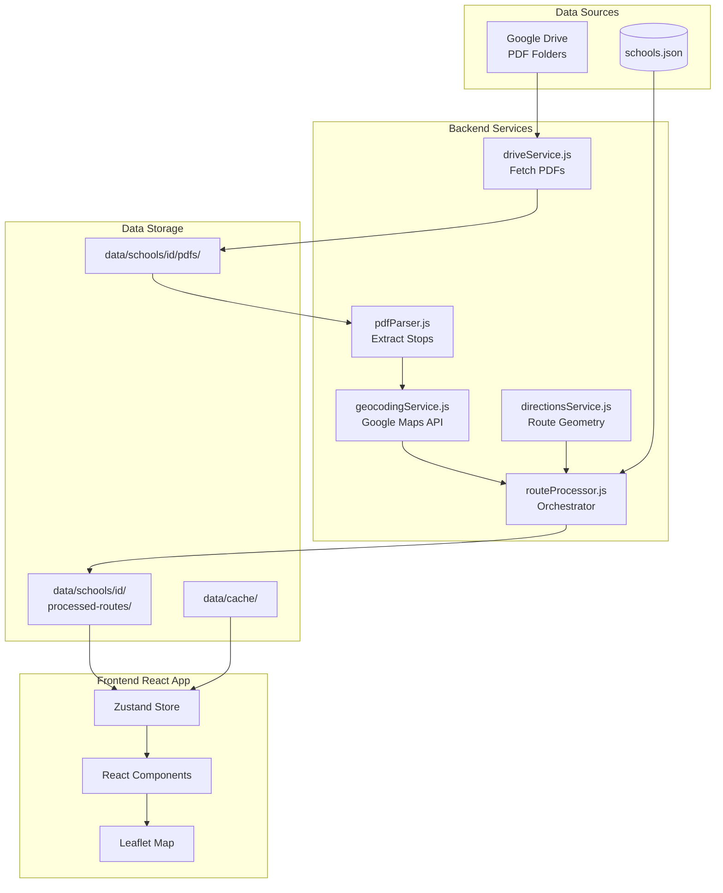
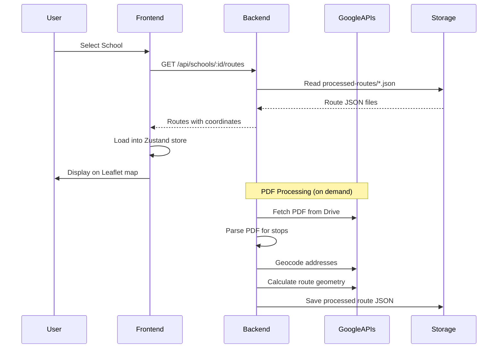

# PPS Bus Route Maps

A web application that automatically fetches bus route PDFs from Google Drive, parses stop locations, and visualizes them on an interactive map.

## Features

- 🔗 **Google Drive Integration**: Automatically fetches PDFs from a Google Drive folder
- 📄 **PDF Parsing**: Extracts route names and cross-street addresses from PDFs
- 🗺️ **Interactive Map**: Visualizes routes with colored lines and stop markers
- 🏠 **Home Address**: Add your address to see it relative to bus stops
- ✅ **Multi-Route Selection**: Select which routes to display on the map

## Setup

### Prerequisites

- Node.js 18+ and npm
- **No API key needed!** The app works with public Google Drive folders without any API key.

### Installation

1. Install dependencies:
```bash
npm run install:all
```

2. (Optional) Set up backend environment for API key (only if you want faster/more reliable access):
```bash
cd backend
cp .env.example .env
```

3. (Optional) If you want to use a Google Drive API key (not required for public folders):
   - Go to [Google Cloud Console](https://console.cloud.google.com/)
   - Create a new project or select an existing one
   - Enable the "Google Drive API"
   - Go to "Credentials" and create an API key
   - Add it to `backend/.env` as `GOOGLE_API_KEY=your_key_here`
   
   **Note:** The app works without an API key by parsing the public Drive folder page. An API key is optional and only provides faster/more reliable access.

### Running the Application

Start both frontend and backend:
```bash
npm run dev
```

Or run them separately:
```bash
# Terminal 1 - Backend
cd backend
npm run dev

# Terminal 2 - Frontend
cd frontend
npm run dev
```

The app will be available at:
- Frontend: http://localhost:3000
- Backend: http://localhost:3005

## Usage

1. **Enter Google Drive Folder Link**: 
   - Paste the Google Drive folder link in the input field
   - Example: `https://drive.google.com/drive/folders/1BC03MH02DFuUL6teeq4jkcT2THRGgzxj`
   - Click "Fetch Routes"

2. **Select Routes**: 
   - Check/uncheck routes in the sidebar to show/hide them on the map
   - Each route has a unique color

3. **Add Your Address**: 
   - Enter your address in the bottom input field
   - A red pin will appear on the map showing your location

## Project Structure

```
pps-bus-maps/
├── backend/           # Node.js/Express backend
│   ├── routes/        # API routes
│   ├── services/      # Business logic (PDF parsing, etc.)
│   └── server.js      # Express server
├── frontend/          # React/TypeScript frontend
│   ├── src/
│   │   ├── components/  # React components
│   │   ├── services/    # API client
│   │   ├── store/        # State management (Zustand)
│   │   └── utils/       # Utilities
│   └── ...
└── ...
```

## Deployment

Ready to deploy? Check out these guides:

- **[QUICK_DEPLOY.md](./QUICK_DEPLOY.md)**: Quick 5-minute guide to deploy on Railway (easiest option)
- **[DEPLOYMENT.md](./DEPLOYMENT.md)**: Comprehensive deployment guide with multiple options (Railway, Render, VPS)

The app is production-ready and can be deployed to:
- **Railway** (recommended for beginners) - Free tier available
- **Render** - Free tier available
- **Vercel + Railway/Render** - Separate frontend/backend
- **VPS** (DigitalOcean, Linode, etc.) - Full control

## Documentation

- **[AGENTS.md](./AGENTS.md)**: Quick reference for AI coding assistants - read this first for rapid context
- **[ARCHITECTURE.md](./ARCHITECTURE.md)**: Comprehensive technical documentation including data flow, services, and API reference
- **[PAGES_INDEX.md](./PAGES_INDEX.md)**: Comprehensive index of all pages in the application, including routes, purposes, features, and components used
- **[TechPage](./frontend/src/pages/TechPage.tsx)**: In-app technical documentation (accessible at `/tech`)
- **[.cursorrules](./.cursorrules)**: Coding conventions and project rules

## How It Works

1. **PDF Fetching**: Backend uses Google Drive API to list and download PDFs from the folder
2. **PDF Parsing**: Extracts text from PDFs and uses regex patterns to identify cross-street addresses
3. **Geocoding**: Converts addresses to coordinates using Google Maps Geocoding API
4. **Visualization**: Frontend uses Leaflet to display routes as colored lines with stop markers

### Architecture Overview



### Data Flow



## Notes

- Geocoding uses OpenStreetMap Nominatim, which has rate limits (1 request/second)
- Large folders may take time to process due to geocoding delays
- PDF parsing relies on consistent formatting - may need adjustments for different PDF structures

## Troubleshooting

**No routes found:**
- Check that the folder contains PDF files
- Verify the folder is publicly accessible (anyone with the link can view)
- Try refreshing - the page parsing method may need a moment

**Slow loading:**
- Without an API key, the app parses the Drive folder page which can be slower
- Consider adding a Google Drive API key to `backend/.env` for faster access (optional)

**"Failed to access folder" error:**
- Make sure the folder is set to "Anyone with the link can view"
- Try opening the folder link in an incognito browser window to verify it's public

**Geocoding fails:**
- Some addresses may not be found - this is normal
- The app will continue with successfully geocoded stops

## License

MIT

