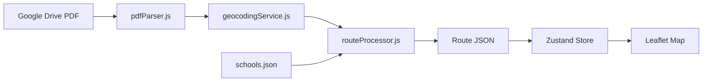

# AGENTS.md - AI Agent Quick Reference

> **Purpose**: Lightning-fast context for AI coding assistants. Read this first.

## TL;DR

**Bus route mapping app for Portland Public Schools (PPS)**

```
PDFs (Google Drive) → Parse stops → Geocode addresses → Display on Leaflet map
```

---

## Tech Stack

| Layer | Technology |
|-------|------------|
| Frontend | React 18 + TypeScript + Vite |
| State | Zustand |
| Maps | Leaflet + react-leaflet |
| Backend | Node.js + Express (ES Modules) |
| Geocoding | Google Maps Geocoding API |
| Routing | Google Maps Directions API |
| Icons | **Font Awesome ONLY** (no react-icons) |

---

## Critical Rules

1. **🚫 NO paid API calls on page load** - Only call external APIs on explicit user action. **✅ EXCEPTION: Address autocomplete is allowed** - Google Places API calls for address autocomplete are explicitly allowed when triggered by user typing (HomePage, Explorer, Admin pages)
2. **🚫 NO react-icons** - Use Font Awesome exclusively (`<i className="fas fa-icon">`)
3. **📍 Coordinate order**: Internal = `[lng, lat]`, Leaflet = `[lat, lng]`
4. **📝 Update TechPage.tsx** when changing functionality
5. **🗂️ Data Management page is DEPRECATED** - Use `/admin` instead

---

## Key Files

```
frontend/
  src/
    types/index.ts          # TypeScript interfaces (Stop, Route, School)
    store/useStore.ts       # Zustand global state
    pages/
      HomePage.tsx          # Landing page - address + school input
      TechPage.tsx          # Technical documentation (UPDATE THIS!)
    components/
      MapView.tsx           # Main Leaflet map component

backend/
  server.js                 # Express server, all API routes
  services/
    driveService.js         # Google Drive PDF fetching
    pdfParser.js            # Extract stops from PDFs
    geocodingService.js     # Google Maps geocoding
    directionsService.js    # Google Maps routing
    routeProcessor.js       # Full PDF→JSON pipeline
    neighborhoodService.js  # Reverse geocoding for neighborhoods

data/
  schools.json              # All schools with coordinates
  schools/{id}/
    pdfs/                   # Raw PDF files
    processed-routes/       # Parsed JSON routes
```

---

## Data Flow



---

## Core Types

```typescript
interface Stop {
  id: string;
  address: string;
  coordinates?: [number, number];  // [lng, lat]
  isSchoolStop?: boolean;
  neighborhood?: string;
}

interface Route {
  id: string;
  name: string;                    // Route number, e.g., "100"
  direction?: 'Morning' | 'Afternoon';
  stops: Stop[];
  geometry?: [number, number][];   // [lat, lng][] for Leaflet polyline
}

interface School {
  id: string;
  name: string;
  coordinates?: [number, number];  // [lng, lat]
  driveLink: string | null;        // Google Drive folder URL
}
```

---

## API Endpoints

| Endpoint | Method | Purpose |
|----------|--------|---------|
| `/api/schools` | GET | List all schools |
| `/api/schools/:id` | GET/PUT | Get/update school |
| `/api/routes/calculate` | POST | Calculate route geometry |
| `/api/geocode/address` | POST | Geocode single address |
| `/api/neighborhoods` | GET | Get neighborhoods from routes |
| `/api/pdf-sync/:schoolId` | POST | Sync PDFs from Drive |

---

## Common Tasks

### Add a new page
1. Create in `frontend/src/pages/`
2. Add route in `frontend/src/App.tsx`
3. Update `docs/meta/PAGES_INDEX.md`

### Add a new API endpoint
1. Create route in `backend/routes/`
2. Register in `backend/server.js`
3. Business logic goes in `backend/services/`

### Work with maps
- Use `DarkModeTileLayer` component
- Convert coords: `[lng, lat]` → `[lat, lng]` for Leaflet
- Icons: `utils/fontAwesomeIcons.ts`

---

## Quick Links

- **Full architecture**: [ARCHITECTURE.md](./ARCHITECTURE.md)
- **Page index**: [PAGES_INDEX.md](./docs/meta/PAGES_INDEX.md)
- **Conventions**: [.cursorrules](./.cursorrules)
- **Types**: [frontend/src/types/index.ts](./frontend/src/types/index.ts)

---

## Environment Variables

```bash
# backend/.env
GOOGLE_MAPS_API_KEY=xxx    # Required for geocoding
GOOGLE_API_KEY=xxx         # Alternative key name
PORT=3002                  # Backend port
```

---

*Last updated: December 2024*


